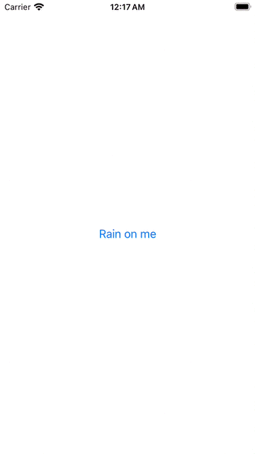

<h1 align="center"> ConfettiView 🎉</p>
<h3 align="center"> The prettiest SwiftUI-native confetti. </h3>
<p align="center">
    
</p>

<br/>

## Get Started

1. Install `ConfettiView`
2. Add `ConfettiView` to your project
```swift
import SwiftUI
import ConfettiView

struct ContentView: View {
    @State var showConfetti = false

    var body: some View {
        Button("Rain on me") {
            showConfetti = true
        }
        .frame(maxWidth: .infinity, maxHeight: .infinity)
        .overlay(ConfettiView(isPresented: $showConfetti))
    }
}
```

<p align="center">
    
</p>
